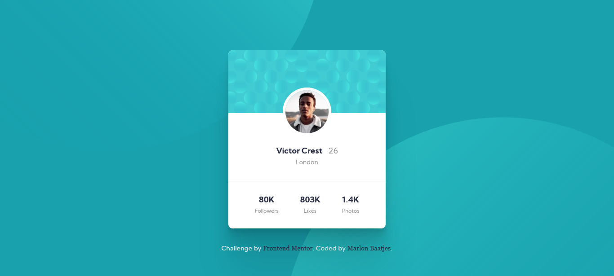

# Frontend Mentor - Profile card component solution

This is a solution to the [Profile card component challenge on Frontend Mentor](https://www.frontendmentor.io/challenges/profile-card-component-cfArpWshJ). Frontend Mentor challenges help you improve your coding skills by building realistic projects. 

## Table of contents

- [Overview](#overview)
  - [The challenge](#the-challenge)
  - [Screenshot](#screenshot)
  - [Links](#links)
- [My process](#my-process)
  - [Built with](#built-with)
- [Author](#author)

## Overview

### The challenge

- Build out the project to the designs provided

### Screenshot

### Links

- Solution URL: [Github Repo](https://github.com/mdesignscode/My_Stylesheets)
- Live Site URL: [Github live site](https://mdesignscode.github.io/My_Stylesheets/)

## My process

### Built with

- Flexbox
- CSS Grid
- Mobile-first workflow
- Scss
- Mixins
- Media Queries
- Animations

## Author

- Frontend Mentor - [@Mdesignscdr](https://www.frontendmentor.io/profile/Mdesignscdr)
